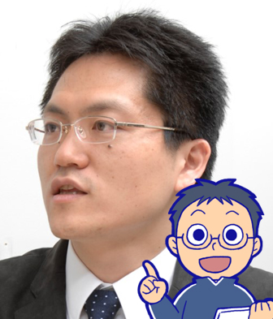
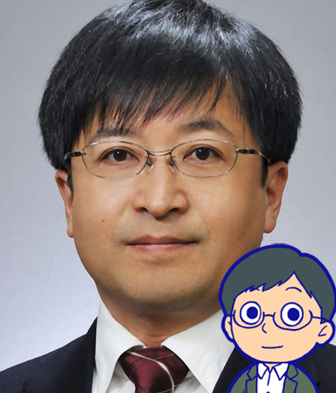

# 講師・スタッフ紹介

## 重田 勝介

北海道大学 情報基盤センターメディア 教育研究部門 准教授  
大阪大学大学院卒(博士 人間科学)。東京大学助教、UC Berkeley Educational Technology Services 客員研究員を経て現職。研究分野は教育工学・オープンエデュケーション。

## 武田 俊之

関西学院大学 高等教育推進センター 教育技術主事  
専門は教育工学、情報科学、ラーニング・アナリティクス。  

## 森 秀樹

大阪大学 教育学習支援センター 特任講師  
大阪大学大学院人間科学研究科博士後期課程中途退学。企業で約13年間に渡り、教育コンテンツ、教育ワークショッププログラムの開発を担当。米国マサチューセッツ工科大学メディアラボ客員研究員、大阪大学大学院人間科学研究科助教、東京大学大学院情報学環特任助教などを経て現職。専門は教育工学、ワークショップ・学習環境デザイン。
